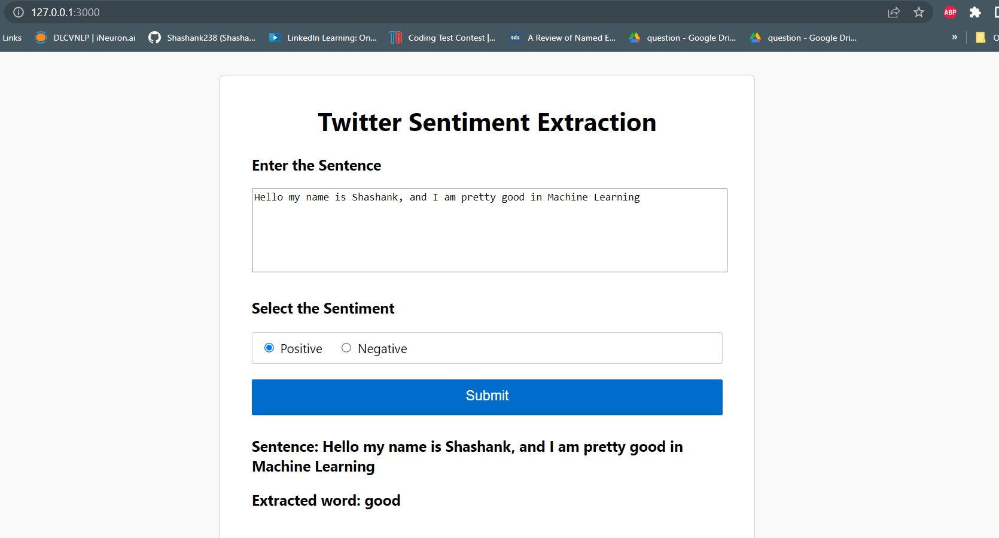

# Tweet Sentiment Extraction

## 📌 Introduction
This is a NLP web application which is used to extract the sentiment word from the text or input entered by the user. 
The dataset is obtained from kaggle competition.

## 🎯 Purpose of this Project
Capturing sentiment in language is important in these   times where 
decisions and reactions are created and updated in seconds. But, which words actually lead to the sentiment description is more important and extract it from the corpus.
To create a model where it can extract the words from the tweets based on the sentiment and serving it to web application using flask framework.

<p align="center">
  
</p>

## 🏁 Technology Stack

* [Transformers](https://arxiv.org/abs/1706.03762)
* [HuggingFace](https://huggingface.co/)
* [PyTorch](https://pytorch.org/)
* [Flask](https://github.com/pallets/flask)

## Installation Steps
1. Clone the Repo by going to your local Git Client and pushing in the command:
```sh
git clone https://github.com/Shashank238/Tweet-Sentiment-Extraction-using-Bert.git
```
2. Install the packages:
```sh
pip install -r requirements.txt
```
3. Download the weights file:
```sh
mkdir weights
```
[click_here_download](https://drive.google.com/file/d/1sc3M5CbacVgjQFnDoZ5YVo4anrxB606p/view?usp=sharing)
place it in weights folder

3. Run the application:
```sh
python app.py
```


